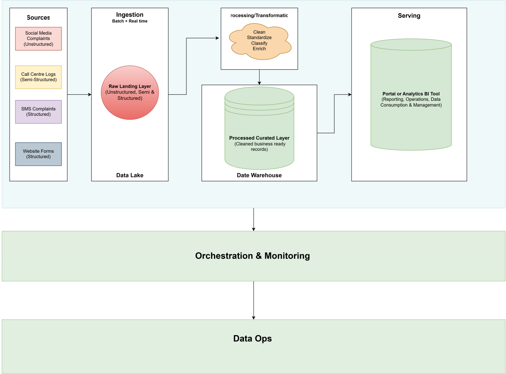

# Beejan Technologies: Customer Complaint Data Pipeline

## Conceptual Diagram

## Design choices

Beejan Technologies receives complaints through multiple channels, with each source potentially having a different structure or format. To reduce the operational burden and frustration from handling these complaints and establish a structured approach to addressing their customer dissatisfaction, the company requires a data pipeline that captures all source data, preserves raw records, standardizes them, and produces a clean and trusted dataset for daily operations, reporting and analysis. The solution/design choice is to separate and tackle the problem in clear stages: customer comlaints source intake, store raw customer records (as-is), validate records, enrich records, classify records, curate a final layer, and consumption.

A layered approach matters because the customer's complaint data comes in messy and inconsistent format. As specified, a complaint may be a short SMS, a long social media post, a call center note, or a structured website form.

## Assumptions and thought process

The following assumptions were made:

- Complaints come from social media (unstructured), call center logs (semi-structured), SMS (structured), and website forms (structured).
- Some channels can be near-real-time, while others may arrive in batches or manual files.
- The same customer can complain across more than one channel, so deduplication and standardization is important.
- A single complaint may contain more than one issue, so classification and prioritization categories is also required.
- Management wants both operational insight and executive reporting.

### 1. Source Identification

The data sources are:

- Social media: public complaints, mentions, hashtags, and feedback. These are fast, noisy, and often unstructured.
- Call center logs: customer issues recorded by support agents, system logs, notes, and issue codes. These are semi-structured and may contain images and other formats.
- SMS: short-form complaint messages from customers. These are short and textual issues.
- Website forms: structured complaint web submissions with customer details, descriptive text, and service categories.

The sources vary in formats and frequency. Social media are likely continuous and event-driven. Call center data can be collected in batches or near real-time. SMS and Website forms can be submitted as customer actions at any time. Because of this, the pipeline needs to handle both streaming and batch records.

### 2. Ingestion Strategy

A flexible ingestion layer is required. Social media customer messages will be accepted as they arrive, while file-based or sources for call center logs and website exports can be ingested on a schedule in batches. Also, raw data will be stored in its original form before processing starts.

This preserves the original record and ensures beejan technologies can trace a problem back to its source for auditability, troubleshooting, or future reprocessing. It'll also make it easier to improve transaformation rules or classification logic later without losing historical context.

### 3. Processing and Transformation

Once the data enters the pipeline, it must be cleaned and standardized. This stage includes:

- standardizing timestamps and date formats
- normalizing categorical data (such as region and location names)
- removing duplicate complaint records
- validating missing or malformed fields
- correcting inconsistent labelling
- Transforming narrative text for keywords and sentiment purposes
- mapping complaints to categories such as network, billing, customer service, quality of service, or other

Complaint classification, enrichment and prioritization is vital. A complaint such as “poor network in Lagos and my bill is wrong” may contain more than one issue. The pipeline will classify the complaint into a primary category and secondary categories as applicable. 

### 4. Storage Options

The company needs both a data lake (for raw data landing) and a data warehouse (curated/final data storage). The raw data repository stores source data in its original state for traceability, auditability and reprocessing. The final data repository stores clean, deduplicated, enriched, and classified complaint records ready for business use.

### 5. Serving

The final data will be easy to query and easy to consume through the data warehouse storage approach. Different users that need different assumed outputs such as but not limited to the below:

- Leadership needs summary dashboards and trend analysis of customer complaints over a period
- Support and contact centre teams need complaint queues and priority lists tackling
- Operational teams need location and recurring issue visibility
- Reporting/BI teams need historical and aggregated issue views for periodic analysis

The serving layer will support both detailed record-level access and high-level summary views. This will help management and internal stakeholders understand complaint volume, complaint types and also root causes, hot issue locations, and the company's service performance changes over time.

### 6. Orchestration and Monitoring

The pipeline will be orchestrated using a mix of real-time and scheduled processing. High-velocity complaints to be handled continuously, while slower inputs will be moved through periodic batches. Monitoring wills be built into every stage so that failures or quality issues are visible quickly.

Sample key monitoring checks include:

- pipeline failure at any point
- missing fields or broken data type formats
- increase or drops in complaint volume from source
- duplicate across channels
- classification drift or new issue category drift
- delayed arrival of expected data from real time source

When these events occur, alerts will notify the relevant teams for necessary action.

### 7. DataOps

To make the solution production-ready, the data pipeline to be operationalized in a dependable operating environment with clear ownership, monitoring, versioning, and disaster recovery plans. This will include ensuring the pipeline can run repeatedly, detect failures, recover, and maintain data quality.

Operationalizing the pipeline for production readiness will not only be about technical soundness; it is also about business continuity. If a source stops sending complaints or if a validation or classification rule changes unexpectedly, the business would be able to know quickly. This will be essential for maintaining trust in what has been built and ultimately decision-making process.

## Challenges

The biggest challenge is inconsistency across sources. Some complaint records may contain precise attributes, while others may be vague. Another challenge is duplicate reporting, because the same customer may post on social media and also contact support. A third challenge is ambiguity in complaint text, especially when one message includes multiple issues at once.

The pipeline design addresses these challenges by keeping raw records, standardizing and enriching them, and maintaining a trusted curated layer for downstream use. It is a practical and realistic blueprint for turning fragmented customer complaints into a business-ready source of insight.

## Summary

This pipeline brings all complaint sources into one conceptual flow, normalizes the data, enriches it within context, classifies it into meaningful categories, and converts it into trusted information for operational and executive and internal stakeholder decision-making. It is designed to help Beejan Technologies move from manual, frustrating and fragmented reporting to a consistent complaint intelligence process that will supports better customer service, faster issue detection, and more actionable business insights.
